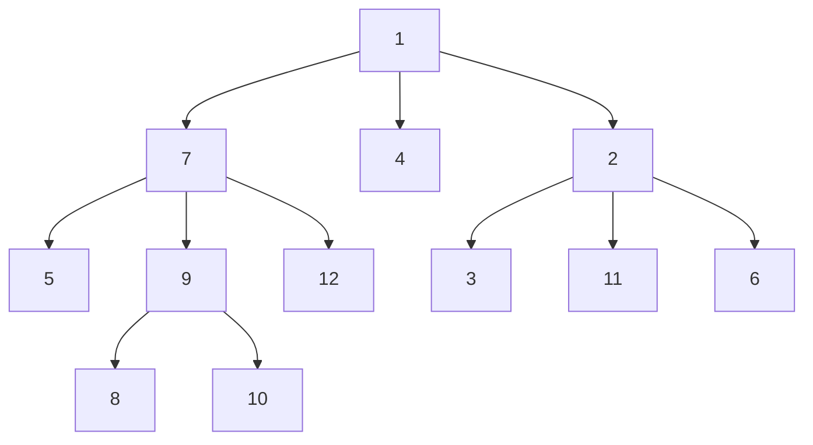
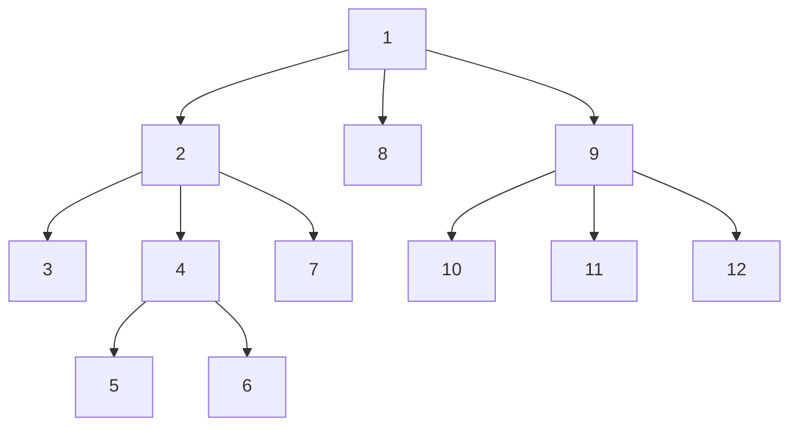

# [LCP 05. 发 LeetCoin](https://leetcode-cn.com/problems/coin-bonus/)

如果单纯的使用 `lazy` 标记进行优化，当题目给定数据为一条退化的链时，查询根节点或者叶子节点时时间复杂度退化至 $O(n)$，从而使得总的时间复杂度变为 $O(n^2)$ , 因此要使用更优秀的做法。

__准备工作__

为了解释思路，我们首先使用编号作为树节点的值，来进行建树，下面是一个例子。

我们将这棵树重排编号，转化为下面这种状态。为了方便区分，将上面这棵树称为`实树`，下面这棵树称为`虚树`。

注意到，转化后得到的虚树有几个优秀的性质：

- 这棵树的先序遍历为 `1, 2, ..., N`, 这意味着我们可以根据实树的先序遍历求出对应的虚树。
- 每一个节点的子树的值是连续的，比如 `4` 的子树为 `5 `, `6`. 这意味着我们可以定义一个 $end(i)$, 其含义为：值为 `i` 的子树中最后一个节点的值是多少。比如对于这个树我们有$end(1)=12,end(2)=6,end(3)=3,end(4)=4,...,end(9)=9$, 而如果我们给 `i` 及其子树发 `LeetCoin`, 就相当于给 $[i...end(i)]$ 这段连续区间内的每个人都发一次 `LeetCoin`, 而查询也转换为  $[i...end(i)]$ 这段连续区间内的每个人得到的  `LeetCoin` 的总和，即转换为区间加和区间查询的问题。

__综上__

对于转化后的虚树，我们现在只需要用支持区间修改和区间查询的数据结构就可以进行解题了。

这里我选用了[树状数组](https://www.cnblogs.com/RabbitHu/p/BIT.html )进行解题。

